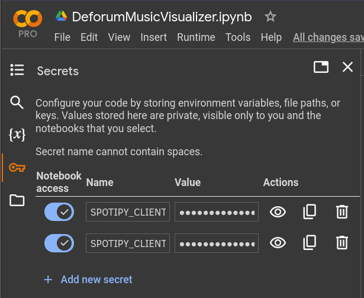

# DeforumMusicVisualizer
DeforumMusicVisualizer aims to enhance your listening experience by creating dynamic and creative visualizations based on your favorite music tracks. Built [StableDiffusion Deforum](https://github.com/deforum-art/deforum-stable-diffusion) and utilizing the [Spotify API](https://developer.spotify.com/documentation/web-api), it generates captivating visuals synchronized with the audio analysis of your tracks, based on their album cover.

  

    

    

https://github.com/nickpadd/DeforumMusicVisualizer/assets/115219791/b7704bfc-8393-443e-9569-985db2f2e282

obiest%20-%20Rock%20On.gif" alt="Funkdoobiest - Rock On" width="256" height="256">
    

  

  

    

    
    
    

  

  

    

    
    
    

  

## Table of Contents
1. [Instructions for Obtaining and Adding Spotify API Tokens](#instructions-for-obtaining-and-adding-spotify-api-tokens)
2. [Instructions of Use](#instructions-of-use)
3. [Colab Notebook](#colab-notebook)
4. [Gradio Interface](#gradio-interface)

## Instructions for Obtaining and Adding Spotify API Tokens

To use the MusicVisualizer, follow these steps to obtain and add Spotify API tokens as secrets in your Colab notebook:

1. **Get Client ID and Client Secret:**
   - Follow the steps provided [here](https://developer.spotify.com/documentation/web-api/tutorials/getting-started) to obtain the spotify client id and spotify client secret.

2. **Add the tokens as google colab secrets**
   - Open the google colab notebook and click on `'Secrets'->'Add new secret' `options on the top left.
   - Create two secrets with the name `'SPOTIPY_CLIENT_ID'` and `'SPOTIPY_CLIENT_SECRET'` where you should copy the spotify tokens.
   - This will ensure the privacy of the spotify tokens while running the notebook.
  

    

    
    

  

3. **Ready to go**
   - You are now ready to start using the notebook and visualize your favourite tracks.

## Instructions of Use

### Colab Notebook
1. It is recommended for the user to take look into [Stable Diffusion Deforum Settings](https://stable-diffusion-art.com/deforum/#Basic_settings_with_examples). Most of the settings can be modified in the Colab notebook for the user in order to finetune the visuals to his/her preferences.
2. Running the notebook requires access to your google drive account. After setting up the environment, all the required files will be under `'AI'` directory.:
    - `'AI/models'` will contain the required checkpoints for running Deforum Stable Diffusion
    - `'AI/StableDiffusion/${YYYY-MM}/${Song_name}'` will contain the visualization frames

3. The final cell of the notebook launches an independent gradio interface for the user to easily use the model for music visualizations.

### Gradio Interface

The Gradio interface follows a simple and easy-to-use top-down format:

1. #### Provide the `spotify-url` of the track you want to create visuals for.
   - While not required, it is recommended that the user also uploads an audio file of the track to ensure optimal synchronization.
   - If an audio file is not provided, [spotify_dl](https://github.com/SathyaBhat/spotify-dl) is used to download the track, but this method may result in lower quality audio, live versions of tracks, unsynchronized visuals, or even the wrong audio track.
   
2. #### Press the `Produce Prompts` button.
    - This triggers the process of retrieving track information (album cover, duration) and producing default prompts for the visualization.

3. #### Final choices
    - It is recommended for the user to take time to **carefully enhance the default prompts**. The prompts will be recycled through the different sections of the song. Any blank prompts will be emmited.
    - **Choose the `duration`** of the song you want to visualize. **Remember**, you can always come back and resume previous visualizations.
    - **Choose the `fps` rate** of the output visual. Higher `fps` rate produces smoother output but takes longer to produce.
    -  **Optional: Choose to resume previous visual**. Tick the `resume` box and provide the timestring identifier of the frames you want to resume on, i.e. `'20240524113018'`. This timestring can be viewed in `'AI/StableDiffusion/${YYYY-MM}/${Song_name}'`, in the name of the frame. It is **important** to keep the same `fps` rate when resuming previous visualizations.

4. #### Press the `Visualize` button.
    - This triggers the visualization process which can take a considerable amount of time. Sit back, drink a cup of coffee and occasionally monitor that everything is running smoothly. 
    - If the gradio cell is run in **debug** mode you can see the frames produced and the progress in the colab notebook.
    - **Remember**, if the runtime gets disconnected or something breaks you can always come back and [**resume**](#final-choices) a previous visualization.

